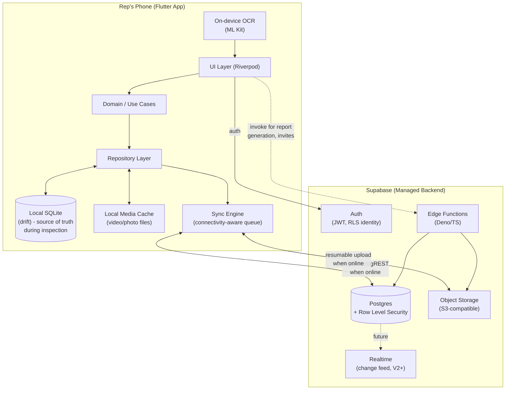

# Technical Architecture Blueprint

## 1. Architecture Style

**Local-first mobile client backed by a managed BaaS (Supabase).** The Flutter app treats its on-device SQLite database as the source of truth *during an inspection*; Supabase is the durable, shared, multi-device system of record that the local database synchronizes with whenever connectivity allows.

There is deliberately no custom backend server for V1. Business logic that cannot safely live on the client runs in Supabase Edge Functions.

## 2. High-Level System Diagram



## 3. Client Architecture (Flutter)

Layered, unidirectional architecture — detailed further in [`06-mobile-app-spec.md`](./06-mobile-app-spec.md):

- **UI layer**: Screens/widgets, Riverpod for state, no direct database or network calls.
- **Domain layer**: Use-case classes (e.g., `StartInspectionUseCase`, `FinalizeInspectionUseCase`) — pure business logic, framework-agnostic, easy to unit test and easy for AI tooling to modify safely in isolation.
- **Repository layer**: The only layer allowed to touch `drift` (local DB), the file system (media cache), or the Supabase client SDK. This abstraction is what makes "local-first with background sync" tractable — the domain layer never knows or cares whether data is local-only, pending sync, or fully synced.
- **Sync Engine**: A background-aware service (using `connectivity_plus` + a persistent local outbox table) that pushes pending local mutations and media uploads to Supabase whenever a connection is available, and pulls remote changes relevant to the signed-in user's company.

## 4. Offline-First Data Flow (Core Design)

This is the most important design decision in the system, given the offline-critical requirement.

### 4.1 Write path (creating/editing an inspection)
1. Every mutation (create equipment record, add checklist response, attach photo, etc.) is written **immediately and only** to the local `drift` database, inside the same local transaction as an **outbox entry** describing the change.
2. Media files (video segments, photos) are written to the app's local sandboxed file storage immediately on capture; an outbox entry references the local file path.
3. The UI reads exclusively from the local database (via reactive `drift` streams), so the UI never blocks on network state — it is impossible for a poor signal to slow down or corrupt an in-progress inspection.

### 4.2 Sync path (when connectivity is available)
1. `SyncEngine` listens for connectivity changes and also runs periodically (via `workmanager` background tasks) while the app is open.
2. Outbox entries are processed in order: structured data mutations sync via Supabase's PostgREST API (small, cheap, reliable); media files sync via Supabase Storage's resumable upload API (large, retried with exponential backoff, chunked where the plugin supports it).
3. Successful sync marks the outbox entry complete and updates a `synced_at` timestamp on the local record. Failure leaves the entry in the queue for retry — **the rep is never blocked, and no data is ever discarded on failure.**
4. Sync status is surfaced honestly in the UI (see FR-29 in the PRD) — a badge/counter of "N items pending upload," never a false "all synced."

### 4.3 Conflict handling
Inspections are **effectively single-writer** in V1 (one rep owns an inspection from start to finish; managers view but don't concurrently edit the same inspection). This means true conflicts are rare by construction. The policy is still explicit:
- Every syncable record has a client-generated **UUID** (created offline, before any server round-trip) so there is never an ID-collision problem on sync.
- Every record carries `updated_at`. If a conflicting remote change is ever detected (e.g., a manager edited a shared field while the rep was offline — not expected in V1's workflow but handled defensively), the system uses **last-write-wins by `updated_at`** and logs the discarded version to an audit table rather than silently deleting it. This is a deliberately simple policy appropriate for V1's actual usage pattern; it is documented here so it's revisited if usage patterns change (e.g., if V2 introduces collaborative review).

### 4.4 Report generation and offline
Report PDF generation is a Supabase Edge Function (server-side), because it needs to composite data, images, and (eventually) branding assets reliably and consistently across devices, and because client-side PDF generation with embedded high-res images is a performance and consistency risk on low-end Android phones. This means:
- A rep can finish an inspection completely offline, but **PDF generation requires connectivity** (this is the one workflow step that isn't offline-capable, and it's called out explicitly in the PRD, FR-23/FR-27).
- The app queues "generate report" as a sync-engine job, so the moment sync completes, report generation is automatically triggered — the rep doesn't have to remember to come back and do it manually.
- The generated PDF is downloaded and cached locally once available so it can be viewed/shared offline afterward.

## 5. AI-Ready Data Pipeline (Designed Now, Used in V2/V3)

Per the architecture principle "AI-ready by design, not AI-built-now," V1's data model makes specific choices that directly enable future AI features without a re-architecture:

- **Every photo/video segment is stored with structured metadata**: which checklist item or walkaround angle it belongs to, equipment category/make/model, timestamp, and (where available) device orientation/GPS. This means a V2 damage-detection model can be trained/run against a clean, labeled corpus instead of an undifferentiated photo dump.
- **Checklist condition ratings are stored as structured enum values**, not free text, so they are directly usable as labels or features for V2/V3 models (e.g., correlating "Undercarriage: Poor" ratings with photos to train a visual damage classifier).
- **The media storage layout in Supabase Storage is partitioned by company → inspection → section/angle** (see [`04-data-model.md`](./04-data-model.md) for the exact path convention), so a future batch AI pipeline can enumerate and process media systematically without a custom indexing layer.
- **Edge Functions are the designated integration point for future AI inference calls** (V2 damage detection, V3 valuation scoring) — because they already run server-side with access to Storage and Postgres, adding a call to an external inference API (e.g., a hosted vision model) or to an in-house model endpoint is an additive change, not a new subsystem.
- **We are not building any AI feature now.** This section exists purely to make sure V1 doesn't foreclose V2/V3 options.

## 6. Media Storage Layout (Supabase Storage)

```
inspections/
  {company_id}/
    {inspection_id}/
      walkaround/
        front.mp4
        left.mp4
        rear.mp4
        right.mp4
        engine_bay.mp4
        undercarriage.mp4
      serial/
        serial_photo.jpg
      hour_meter/
        hour_meter_photo.jpg
      checklist/
        {checklist_item_id}/
          photo_1.jpg
      reports/
        report_v1.pdf
```

Bucket access is governed by Storage RLS-equivalent policies scoped to `company_id`, matching the Postgres RLS model (see [`08-security-compliance.md`](./08-security-compliance.md)).

## 7. Deployment & Environments

- **Environments**: `dev` and `production` Supabase projects (separate projects, not just separate schemas, to avoid any risk of dev data or dev keys touching production). A `staging` environment is deferred until there's a second developer or a compliance requirement forcing it.
- **Mobile release channels**: Internal testing (TestFlight / Play Internal Testing) for the founder and pilot dealership reps, promoted to production release once the pilot workflow is validated.
- **CI/CD**: Codemagic builds and distributes the Flutter app on push to `main`/tagged releases (see [`10-tech-stack.md`](./10-tech-stack.md)). Database schema changes are managed as versioned SQL migrations (Supabase CLI) checked into the repo — **no manual schema edits via the Supabase dashboard in production.**

## 8. What This Architecture Explicitly Defers

- A custom backend service — revisit only if Edge Functions become a bottleneck (e.g., heavy AI inference workloads in V2/V3 that need GPU infrastructure Supabase can't provide).
- Multi-region deployment — single-region Supabase project is sufficient for a regional pilot and initial launch.
- Event-driven/queue infrastructure (e.g., SQS, Kafka) — the outbox-pattern sync engine and Edge Functions cover V1/V2 needs without additional infrastructure.
