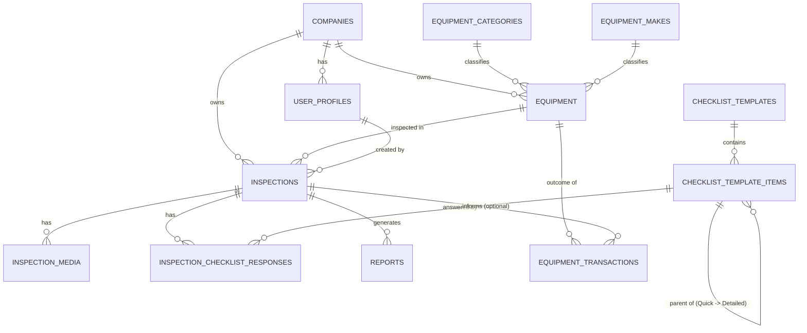

# Data Model & Schema

**Synced with `docs/15-final-product-specification.md` following the founder approval review (see `docs/16-founder-approval-checklist.md`).** Where this document and `docs/15` differ on anything not reflected here, `docs/15` still wins — this sync pass covers the schema-level detail most relevant to Week 1 implementation.

This schema is the Postgres (Supabase) source of truth. The local `drift` (SQLite) schema on-device mirrors this structurally (see [`06-mobile-app-spec.md`](./06-mobile-app-spec.md)), with additional local-only bookkeeping columns for sync state.

Multi-tenancy is enforced by a `company_id` column on every tenant-scoped table, combined with Postgres Row Level Security policies (detailed in [`08-security-compliance.md`](./08-security-compliance.md)). This is designed in from day one per the multi-tenant SaaS principle, even though V1 launches with a small number of pilot companies.

## 1. Entity-Relationship Overview



## 2. Core Tables

### `companies` (tenant root)
```sql
create table companies (
  id uuid primary key default gen_random_uuid(),
  name text not null,
  slug text unique not null,
  logo_url text,
  report_footer_text text,           -- e.g. legal disclaimer, phone number
  region text,                        -- coarse location (state/zip/named region) — Founder Decision #5; per-inspection GPS explicitly deferred
  is_active boolean not null default true,
  created_at timestamptz not null default now()
);
```

### `user_profiles` (extends Supabase `auth.users`)
```sql
create table user_profiles (
  id uuid primary key references auth.users(id) on delete cascade,
  company_id uuid not null references companies(id),
  full_name text not null,
  role text not null check (role in ('owner', 'admin', 'manager', 'rep')),
  is_active boolean not null default true,
  created_at timestamptz not null default now()
);
```
See [`09-multi-tenant-saas-strategy.md`](./09-multi-tenant-saas-strategy.md) for the role model definition.

### `equipment_categories` (reference data, not tenant-scoped)
```sql
create table equipment_categories (
  id uuid primary key default gen_random_uuid(),
  name text unique not null           -- e.g. 'Excavator', 'Skid Steer', 'Wheel Loader'
);
```

### `equipment_makes` (reference data, not tenant-scoped)
```sql
create table equipment_makes (
  id uuid primary key default gen_random_uuid(),
  name text unique not null           -- 'Caterpillar', 'Bobcat', ... 'Other'
);
```
See [`12-equipment-taxonomy.md`](./12-equipment-taxonomy.md) for seed data and extensibility rules.

### `equipment` (tenant-scoped)
```sql
create table equipment (
  id uuid primary key default gen_random_uuid(),
  company_id uuid not null references companies(id),
  category_id uuid not null references equipment_categories(id),
  make_id uuid not null references equipment_makes(id),
  model text not null,                 -- free text, autocomplete-assisted in UI
  year int,
  serial_number text,                  -- authoritative value once confirmed
  customer_stock_ref text,             -- optional dealership-internal reference
  created_at timestamptz not null default now(),
  created_by uuid references user_profiles(id)
);
create index idx_equipment_company on equipment(company_id);
create index idx_equipment_serial on equipment(company_id, serial_number);
```

### `inspections` (tenant-scoped)
```sql
create table inspections (
  id uuid primary key default gen_random_uuid(),   -- client-generated UUID (offline-safe)
  company_id uuid not null references companies(id),
  equipment_id uuid not null references equipment(id),
  created_by uuid not null references user_profiles(id),

  -- Status is three independent fields, not one flat enum (docs/15 §8 / §17 row 17.3):
  -- completion_status is set locally/offline by the rep; sync_status and report_status
  -- only ever progress once the device has connectivity.
  completion_status text not null check (completion_status in ('in_progress', 'completed'))
    default 'in_progress',
  sync_status text not null check (sync_status in ('local_only', 'syncing', 'synced'))
    default 'local_only',
  report_status text not null check (report_status in ('not_generated', 'generating', 'generated'))
    default 'not_generated',

  hour_meter_reading numeric,
  hour_meter_capture_method text check (hour_meter_capture_method in ('ocr', 'manual')),
  serial_capture_method text check (serial_capture_method in ('ocr', 'manual')),
  overall_notes text,
  started_at timestamptz not null default now(),
  completed_at timestamptz,
  updated_at timestamptz not null default now()
);
create index idx_inspections_company on inspections(company_id);
create index idx_inspections_equipment on inspections(equipment_id);
create index idx_inspections_created_by on inspections(created_by);
```

Server-side `generate-report` (see [`05-api-design.md`](./05-api-design.md)) is the sole authoritative gate that advances `report_status`, re-validating required data regardless of what the client's `completion_status` already claims — the client-side check is a UX convenience, never a trust boundary (docs/15 §8).

### `checklist_templates` / `checklist_template_items` (reference data)
Data-driven checklist — sections/items live in the database, not hardcoded in the app, and can be scoped per equipment category. Template versioning was considered and dropped (docs/15 §9, `docs/14-pre-development-review.md` §3.1) in favor of one always-current template per category plus snapshot-on-write on the response table below.

**One inspection engine, two experience depths (Founder Decision #1, docs/15 §5/§9)**: `checklist_template_items` is self-referencing via a nullable `parent_item_id`. Rows with `parent_item_id = null` are the 6-8 top-level Quick Condition Scorecard categories (Engine, Hydraulics, Undercarriage/Tires/Tracks, Cab & Controls, Structure/Frame, Attachments, Overall Cosmetic Condition). Rows with a non-null `parent_item_id` are that category's Detailed Inspection sub-items — the original granular, per-part checklist — surfaced in the UI only when the rep expands that category. There is no separate table or template for "Detailed Inspection"; it is the same template, one level deeper.

```sql
create table checklist_templates (
  id uuid primary key default gen_random_uuid(),
  category_id uuid references equipment_categories(id), -- null = applies to all categories
  is_active boolean not null default true,
  created_at timestamptz not null default now()
);

create table checklist_template_items (
  id uuid primary key default gen_random_uuid(),
  template_id uuid not null references checklist_templates(id),
  parent_item_id uuid references checklist_template_items(id), -- null = top-level Quick Scorecard category; non-null = Detailed sub-item of that category
  section text not null,              -- 'Engine', 'Hydraulics', 'Undercarriage', etc. (matches the top-level category even for child rows, for easy grouping)
  label text not null,                -- 'Engine' (top-level) or 'Engine oil level/condition' (Detailed sub-item)
  sort_order int not null,
  requires_photo boolean not null default false
);
create index idx_checklist_items_parent on checklist_template_items(parent_item_id);
```

### `inspection_checklist_responses` (tenant-scoped, via parent inspection)
Answered identically whether responding to a top-level Quick category or a Detailed sub-item — same table, same validation, same sync logic (docs/15 §9). A Quick-only inspection simply has no response rows for any child items; a fully Detailed inspection has them for every child the rep chose to expand.

```sql
create table inspection_checklist_responses (
  id uuid primary key default gen_random_uuid(),
  inspection_id uuid not null references inspections(id) on delete cascade,
  template_item_id uuid not null references checklist_template_items(id),
  condition_rating text not null check (condition_rating in ('good', 'fair', 'poor', 'n_a')),
  -- Application-level convention (not enforced by this constraint): top-level Quick Condition
  -- Scorecard responses (template_item_id -> parent_item_id is null) are presented to the rep as a
  -- 3-state control (good/fair/poor only); 'n_a' is only ever written for Detailed Inspection
  -- sub-item responses (parent_item_id is not null), per docs/07-inspection-workflow.md Step 6 and
  -- docs/15-final-product-specification.md §5. The client UI is responsible for this restriction.
  notes text,

  -- Snapshot-on-write (docs/15 §9, docs/14 §4.1): copied from the template item at write time so a
  -- later edit to template wording never silently changes the meaning of a previously generated report.
  section_snapshot text not null,
  label_snapshot text not null,

  created_at timestamptz not null default now(),
  unique (inspection_id, template_item_id)
);
```

### `inspection_media` (tenant-scoped, via parent inspection)
This is the table that makes the AI-ready pipeline (Section 5 of [`03-technical-architecture.md`](./03-technical-architecture.md)) possible — every media asset is structurally labeled. **Updated for the continuous walkaround video model** (docs/15 §5, Founder Decision #1): the walkaround is one continuous recording, not seven separate clips, so it is one row with structured timestamp markers rather than seven rows.

```sql
create table inspection_media (
  id uuid primary key default gen_random_uuid(),
  inspection_id uuid not null references inspections(id) on delete cascade,
  media_type text not null check (media_type in ('video', 'photo')),
  purpose text not null check (purpose in (
    'walkaround_video',      -- one continuous recording per inspection
    'serial_plate', 'hour_meter', 'checklist_item'
  )),
  checklist_response_id uuid references inspection_checklist_responses(id), -- set when purpose = 'checklist_item' (Quick category photo or Detailed sub-item photo)

  -- Populated only when purpose = 'walkaround_video': ordered list of prompts and when they
  -- appeared during the continuous recording, e.g. [{"label": "Front", "offset_seconds": 0},
  -- {"label": "Left Side", "offset_seconds": 8.2}, ...]. This is what lets the report (Section 12,
  -- docs/15) and any future AI pipeline isolate "the undercarriage portion" of the video without
  -- needing separate files.
  timestamp_markers jsonb,

  storage_path text not null,          -- path within the inspections/ bucket, see architecture doc
  local_file_path text,                -- device-local path pre-sync (not populated server-side)
  captured_at timestamptz not null default now(),
  synced_at timestamptz
);
create index idx_media_inspection on inspection_media(inspection_id);
```

### `reports` (tenant-scoped, via parent inspection)
```sql
create table reports (
  id uuid primary key default gen_random_uuid(),
  inspection_id uuid not null references inspections(id) on delete cascade,
  storage_path text not null,          -- PDF location in Storage
  generated_at timestamptz not null default now(),
  generated_by_function text not null default 'generate-report-v1', -- Edge Function version tag

  -- Share audit fields (Founder Decision #6; docs/15-final-product-specification.md §13).
  -- V1 sharing is native-share-sheet only — no custom email-sending infrastructure exists in V1.
  -- These columns record that a share/export action happened, for the dealership's own
  -- audit/history purposes ("did this report go out"). They are NOT a delivery or open-tracking
  -- mechanism: the OS share sheet gives no confirmation the recipient received or opened
  -- anything, and IronSight AI does not send email on the dealership's behalf in V1. Branded,
  -- delivery/open-tracked email sending is an explicit, separate V2 feature (docs/15 §13).
  shared_at timestamptz,                -- set the first time the rep shares/exports the report; null if never shared
  shared_via text check (shared_via in ('native_share_sheet', 'email', 'download', 'other'))
    -- Coarse record of the action taken, not a guaranteed delivery channel: most platform share-sheet
    -- APIs do not reliably report which specific destination app the rep chose. 'native_share_sheet' is
    -- the default value when only "a share action occurred" is knowable; 'email'/'download'/'other' are
    -- used only where the platform API actually exposes that level of detail.
);
```

**Purpose of `shared_at`/`shared_via`**: record *when* a report was shared and by *what general method* (Step 10 of [`07-inspection-workflow.md`](./07-inspection-workflow.md)), purely for the dealership's internal audit/history — not to power any delivery guarantee, read receipt, or automated email-sending feature. Both columns are nullable because an inspection can be completed and reported without ever being explicitly shared from within the app (e.g., the rep only needed the in-app "View Report").

### `sync_conflict_log` (defensive, tenant-scoped)
Per Section 4.3 of the architecture doc — records any discarded version in a last-write-wins conflict, for auditability rather than silent data loss.
```sql
create table sync_conflict_log (
  id uuid primary key default gen_random_uuid(),
  company_id uuid not null references companies(id),
  table_name text not null,
  record_id uuid not null,
  discarded_payload jsonb not null,
  reason text not null,
  occurred_at timestamptz not null default now()
);
```

### `equipment_transactions` (tenant-scoped, schema-only in V1 — Founder Decision #4)
Added to the V1 schema now, with **no in-app UI** in V1. The founder or an authorized manager enters transaction outcomes through a controlled admin/database process during the pilot. Exists so that real-world trade/sale outcomes — the ground-truth signal V3's valuation engine will eventually train against — start accumulating from day one rather than being lost for every deal that closes before this table exists (docs/15 §9).

```sql
create table equipment_transactions (
  id uuid primary key default gen_random_uuid(),
  company_id uuid not null references companies(id),
  equipment_id uuid not null references equipment(id),
  inspection_id uuid references inspections(id),   -- nullable: the specific inspection this outcome relates to, when known
  transaction_type text not null check (transaction_type in (
    'trade_in', 'retail_sale', 'wholesale_sale', 'consignment_sale', 'auction_sale', 'other'
  )),
  trade_offer_amount numeric,       -- all monetary fields nullable: not every transaction provides every outcome
  accepted_trade_value numeric,
  asking_price numeric,
  final_sale_price numeric,
  transaction_date date,
  sale_date date,
  currency text not null default 'USD',
  source text not null default 'manual_entry' check (source in ('manual_entry', 'dms_import', 'crm_import', 'other')),
  notes text,
  created_by uuid references user_profiles(id),
  created_at timestamptz not null default now()
);
create index idx_equipment_transactions_equipment on equipment_transactions(equipment_id);
create index idx_equipment_transactions_company on equipment_transactions(company_id);
```

`equipment_id` is the required anchor; `inspection_id` is optional and links a transaction to the specific inspection that informed it when known, so a future valuation model can pair verified outcomes with the exact condition data that preceded them rather than inferring the nearest inspection by date.

## 3. Local (Device) Schema Additions

The on-device `drift` schema mirrors the tables above with two additional bookkeeping columns on every syncable table:

- `sync_status` (`pending` | `syncing` | `synced` | `error`)
- `local_updated_at` (device-clock timestamp, used to drive the outbox queue — distinct from the server's `updated_at`)

Plus a dedicated local-only `outbox` table:
```
outbox(
  id, table_name, record_id, operation ['insert'|'update'],
  payload_json, media_local_path (nullable),
  attempt_count, last_attempt_at, created_at
)
```

## 4. Design Notes

- **UUIDs are always client-generated**, not server-assigned, specifically so an inspection created fully offline never needs a server round trip to get an ID before local relationships (checklist responses, media) can reference it.
- **Reference/taxonomy tables (`equipment_categories`, `equipment_makes`, `checklist_templates`) are seeded server-side and pulled to the device on login/refresh**, then cached locally so equipment selection and checklist rendering work fully offline.
- **No hard deletes** on inspection data in V1 — corrections are handled via edits with `updated_at` tracking, not deletion, preserving a defensible audit trail (relevant given inspections may be used in customer/lender-facing contexts). Discarding a draft (docs/15 §5) is a soft flag, not a delete.
- **One inspection engine, not two.** The Quick Condition Scorecard and the Detailed Inspection are the same `checklist_template_items`/`inspection_checklist_responses` tables at two levels of a self-referencing hierarchy (`parent_item_id`), not separate systems. This is a deliberate, load-bearing design choice — see `docs/15-final-product-specification.md` §5 and §9 for the full rationale.
- **Status is three independent fields on `inspections`** (`completion_status`, `sync_status`, `report_status`), not one flat enum, so "the rep is done" and "the server has the data" and "the report exists" can never be confused with each other (docs/15 §8).
- **Outcome and location data (`equipment_transactions`, `companies.region`) exist from V1** even though neither has a V1 UI, because both are impossible to backfill onto historical records once missed and both are direct inputs to V3/V4 (docs/15 §9, Founder Decisions #4 and #5).
