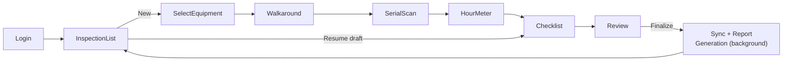

# Flutter Mobile App Specification

## 1. Project Structure

```
lib/
  main.dart
  app/
    router.dart               # go_router route table
    theme.dart
  core/
    connectivity/              # connectivity_plus wrapper, exposed as a Riverpod stream provider
    supabase_client.dart       # single Supabase client instance
    errors/
  data/
    local/
      drift/
        tables/                # drift table definitions mirroring 04-data-model.md
        database.dart
        daos/
    remote/
      supabase/
        <entity>_remote_source.dart   # thin wrappers over supabase_flutter calls
    repositories/
      equipment_repository.dart
      inspection_repository.dart
      checklist_repository.dart
      media_repository.dart
      auth_repository.dart
    sync/
      outbox.dart
      sync_engine.dart
      media_upload_queue.dart
  domain/
    entities/                  # plain Dart models, no drift/supabase types leak past this layer
    use_cases/
      start_inspection.dart
      capture_serial_number.dart
      capture_hour_meter.dart
      submit_checklist_response.dart
      finalize_inspection.dart
  features/
    auth/
    inspection_list/
    inspection_capture/
      walkaround/
      serial_scan/
      hour_meter/
      checklist/
      review/
    company_admin/             # minimal invite/roster screens
  shared_widgets/
```

**Rule enforced across the codebase:** only `data/` may import `drift` or `supabase_flutter`. `domain/` and `features/` (UI) never import them directly — they depend on repository interfaces. This is what allows the local-vs-remote/offline-vs-online complexity to stay contained and testable, and it's a rule that's easy for both a solo founder and AI coding assistants to follow consistently because it's structurally enforced by import boundaries, not just convention.

## 2. State Management (Riverpod)

- `StateNotifierProvider`/`AsyncNotifierProvider` per feature for UI state.
- Repositories are exposed as providers and injected into use cases — no service locators, no `BuildContext`-based DI, so dependencies are explicit and traceable (important for AI-assisted refactors: an assistant can see exactly what a widget depends on without whole-app context).
- Reactive local data (e.g., "list of inspections") is exposed via `StreamProvider` backed directly by a `drift` watch query, so the UI updates immediately on local writes, before any sync happens.

## 3. Camera & Video Capture Module

- Built on the `camera` plugin, not `image_picker`, because the guided walkaround (FR-8) requires:
  - A custom capture UI showing the current required angle ("Front," "Left Side," etc.) as an overlay.
  - Per-segment start/stop control with the ability to re-record a single segment (FR-10) without discarding the others.
  - Consistent resolution/bitrate settings across devices to keep report file sizes and upload times predictable (target: 720p, H.264, capped bitrate — tuned during pilot based on real device testing).
- Each completed segment is written to the app's sandboxed local storage immediately (`path_provider`'s app documents directory), named by inspection ID and purpose, matching the `inspection_media.purpose` enum in the data model.

## 4. OCR Module (Serial Number & Hour Meter)

- Uses `google_mlkit_text_recognition`, which runs the recognition model **on-device** — no network call, so it works with the phone in airplane mode, satisfying FR-11/FR-14.
- Flow: live camera preview → user taps capture (or auto-capture on stable focus, evaluated during pilot UX testing) → frame passed to ML Kit → recognized text blocks are heuristically filtered (e.g., longest alphanumeric string near the tapped region) → **result is always presented to the rep for confirmation before being saved**, with a manual edit field always visible — OCR is a speed assist, never a silent authority, because a wrong serial number has real business consequences.
- The source photo is retained regardless of whether OCR succeeded, per FR-12/FR-15.

## 5. Local Database (`drift`)

- Schema mirrors [`04-data-model.md`](./04-data-model.md) with the added `sync_status`/`local_updated_at` columns described there.
- `drift`'s generated, type-safe DAOs are the only way the `data/local` layer touches SQL — no raw string queries, minimizing an entire class of bugs an AI-assisted solo dev could otherwise introduce silently.
- Local schema migrations are written explicitly (via `drift`'s migration API) and tested against a fixture of a populated V(n-1) database before release — offline-first apps cannot assume a clean reinstall on every update, since a rep's in-progress inspection data must survive an app update.

## 6. Sync Engine

- **Trigger conditions**: connectivity regained (`connectivity_plus` stream), app foregrounded, periodic background check (`workmanager`, subject to iOS/Android background execution limits — sync is best-effort in the background and guaranteed on next foreground open).
- **Outbox pattern**: every local mutation enqueues an outbox row (Section 3 of the data model doc). The sync engine drains the outbox FIFO per-inspection to preserve logical ordering (e.g., don't sync a checklist response before its parent inspection exists remotely).
- **Media upload queue**: separate from the structured-data outbox because media uploads are larger, slower, and more failure-prone. Uses chunked/resumable upload where the Supabase Storage client supports it, with capped retry/backoff, and never blocks structured-data sync (a rep's checklist answers sync even if a video is still uploading).
- **Idempotency**: all upserts use the client-generated UUID as the conflict key (`upsert` semantics), so a retried sync after a partial failure never creates duplicates.
- **Visibility**: a persistent, honest sync-status indicator (global app bar badge + per-inspection status chip) per FR-29 — this is a product requirement, not just an engineering nicety, because false confidence in "everything's synced" is the single worst failure mode for a field tool.

## 7. Screen Flow



Every arrow in this flow is resumable — a rep can exit at any point (app closed, phone died, interrupted by a customer) and resume exactly where they left off, because state is persisted locally after every step, not just at the end.

## 8. Device Support Targets

See [`11-non-functional-requirements.md`](./11-non-functional-requirements.md) for the full matrix; summarized here for app-spec context: iOS 14+, Android 8 (API 26)+, tested against a mid-range Android reference device in addition to whatever iPhone the founder carries, specifically because field reps are not guaranteed to have flagship hardware.

## 9. Testing Strategy (V1-appropriate, not exhaustive)

Given a solo founder building with AI assistance, testing effort is prioritized where bugs are most costly:

1. **Unit tests** on `domain/use_cases` (pure logic, cheap to test, highest leverage).
2. **Repository tests** against the local `drift` database (in-memory) to validate the outbox/sync bookkeeping logic — this is the highest-risk area in the whole app (silent data loss is the worst possible bug for this product).
3. **Manual device testing checklist** for camera/OCR flows (inherently hard to unit test meaningfully) — executed before every pilot-facing release, in airplane mode explicitly, per pilot dealership visit.
4. Widget/integration tests are added opportunistically, not required for V1 velocity — explicitly deferred, not skipped forever.
