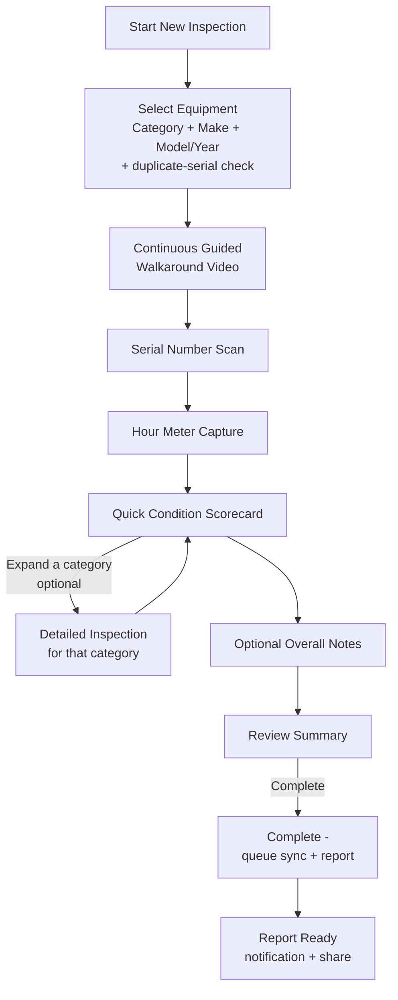

# Inspection Workflow — UX Specification

**Superseded and rewritten following the founder approval review** (`docs/16-founder-approval-checklist.md`, Decision #1). This is the concrete, screen-by-screen flow a rep experiences, reflecting the approved **progressive depth model**: one inspection engine, with a fast default depth (Quick Appraisal) and an optional, per-category expandable depth (Detailed Inspection). The authoritative summary of this design lives in [`15-final-product-specification.md`](./15-final-product-specification.md) §5 — this document adds screen-level UX detail beneath it.

## Flow Overview

## Step 1 — Start New Inspection
Rep taps a single prominent "New Inspection" action from the inspection list. No setup screen, no configuration, no depth to choose upfront — the rep starts, and depth is decided category-by-category later, in Step 6.

## Step 2 — Select Equipment
- Category picker (visual grid: Excavator, Skid Steer, Wheel Loader, Dozer, etc. — see [`12-equipment-taxonomy.md`](./12-equipment-taxonomy.md)).
- Make picker (logos/list: Caterpillar, Bobcat, John Deere, Komatsu, Doosan, Kubota, Case, Volvo, Takeuchi, Other).
- Model (free text with autocomplete), Year, optional stock/customer reference.
- All of this works fully offline against the locally cached taxonomy.

## Step 3 — Continuous Guided Walkaround Video
- Full-screen camera view, **one continuous recording**, with a persistent overlay showing the current suggested angle (e.g., "Front → walk to Left Side"). The overlay advances automatically on a timer, with a manual "next" tap for reps moving faster or slower than the default pace.
- Sequence: Front → Left Side → Rear → Right Side → Engine Bay → Undercarriage/Tires → Cab Interior. The app timestamps the moment each prompt appears and stores these as structured markers alongside the video file (`inspection_media.timestamp_markers` — see [`04-data-model.md`](./04-data-model.md)).
- A single, prominent **"Restart Walkaround"** action discards the current take entirely and begins a fresh continuous recording — since a rep can no longer re-record just one bad segment in isolation, this is the deliberate replacement for the old per-segment "Retake" control.
- Rep can advance past an angle if physically inaccessible (e.g., equipment against a wall) — skipped angles are flagged in the report rather than silently omitted, preserving report integrity/defensibility.

## Step 4 — Serial Number Scan
- Camera view with a framing guide ("Align serial plate within the box").
- Auto-attempt OCR on stable focus; detected text candidates shown as tappable chips for **confirmation, not blind acceptance** — the top-confidence guess is pre-highlighted but never silently auto-filled.
- "Can't find it / enter manually" always visible as a fallback — never a dead end.
- Underlying source photo always saved regardless of OCR outcome.
- Immediately after confirmation, a non-blocking duplicate check runs against `equipment` for this company/serial. If a match exists: *"This machine has N prior inspection(s) — continue with this equipment record?"* — one tap either way, never blocking.

## Step 5 — Hour Meter Capture
- Same pattern as Step 4: camera + OCR candidate chips + manual fallback + retained source photo.

## Step 6 — Quick Condition Scorecard (default depth) with per-category Detailed Inspection (optional depth)
- Single screen listing the fixed top-level categories: Engine, Hydraulics, Undercarriage/Tires/Tracks, Cab & Controls, Structure/Frame, Attachments (if applicable), Overall Cosmetic Condition.
- Each category: a large, thumb-friendly three-state segmented control — **Good / Fair / Poor** — answerable in one tap. Rating a category alone is a complete, valid, submittable inspection.
- Each category also carries a **chevron/expand affordance**. Tapping it opens that category's Detailed Inspection sub-screen:
  - The original granular, per-part checklist for that category only (e.g., under Engine: oil level/condition, coolant level, belts/hoses, visible leaks), each with its own Good/Fair/Poor/N/A rating, optional photo, and optional note.
  - Collapsing back returns to the Quick Condition Scorecard; the category's top-level rating and any Detailed sub-item answers are both retained.
- A rep may expand **any subset** of categories — none, one, several, or all seven — entirely at their own discretion, per category, in the moment. This is never a global "mode switch" decided at the start of the inspection.
- Autosave on every response (Quick or Detailed) — no explicit "save" step, consistent with the local-first architecture (every tap is already a durable local write).

## Step 7 — Optional Overall Notes
A single free-text field for anything not captured by the structured scorecard — always optional, always fast to skip.

## Step 8 — Review Summary
- Single scrollable summary: equipment info, serial/hour-meter with thumbnails, walkaround video thumbnail/marker list, Quick Condition Scorecard results with any "Fair"/"Poor" ratings visually flagged, and — nested beneath any category that was expanded — its Detailed Inspection sub-item results.
- Tapping any section jumps back to edit it directly.

## Step 9 — Complete
- Single "Complete" action.
- The client re-runs a fast, local presence check (serial present, at least a partial video, every top-level category rated) so the rep gets instant feedback while still standing next to the machine — this sets `completion_status = 'completed'` locally and is a UX convenience, never the authoritative gate (see [`04-data-model.md`](./04-data-model.md) and [`05-api-design.md`](./05-api-design.md) for the server-side re-validation that actually governs report generation).
- Immediate, honest feedback: "Saved. Syncing when connected." if offline, or "Syncing now..." progress if online.
- Rep is free to immediately start a new inspection — Complete never blocks on network activity.

## Step 10 — Report Ready
- In-app status indicator once the report PDF has been generated (server-side, requires connectivity — see `15-final-product-specification.md` §12). True push notifications are a named V2 feature, not a V1 promise.
- The report renders exactly as much depth as was actually captured: each category's summary rating, with any expanded category's Detailed sub-items nested beneath it.
- Direct access to the native share sheet (email, text, AirDrop/Nearby Share) plus in-app "View Report" from the inspection list at any time afterward (`15-final-product-specification.md` §13).

## Design Principles Applied Throughout

- **Never block on network.** Every screen through Step 9 must be fully usable in airplane mode — including going fully Detailed on every category.
- **Confirm, don't assume.** OCR and any future AI-derived data is always presented for human confirmation via selectable candidates, never silently trusted, given the business consequences of wrong equipment data.
- **Resumability by default.** Every step's data is durably saved the instant it's entered; closing the app is never destructive.
- **Depth is opt-in, never forced.** The default path (Quick Condition Scorecard, no categories expanded) must remain fast enough to satisfy the core promise on its own. Detailed Inspection exists so that appetite for thoroughness has somewhere to go *other than* the default path.
- **Minimize taps and typing.** Segmented condition buttons over dropdowns, autocomplete over free typing, camera-first over manual data entry wherever OCR can plausibly help.
