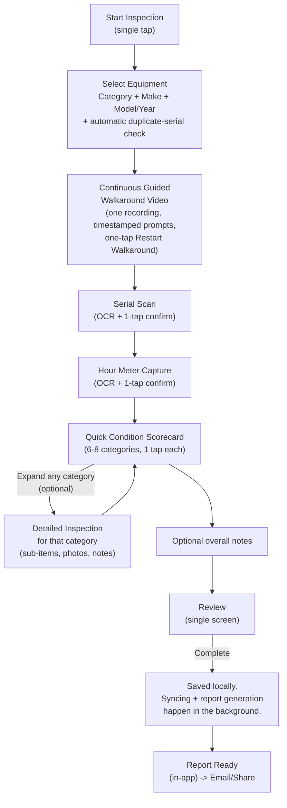

# WIW — Final Product Specification (V1)

**Status: Single Source of Truth — all founder decisions resolved.** This document consolidates every approved decision from `docs/01`–`docs/14` into one coherent specification. Where it conflicts with an earlier document, **this document wins** — earlier docs remain useful for the detailed rationale/SQL/diagrams behind a decision, but the ruling here is final. Section 17 lists every contradiction found and how it was resolved. Section 18 lists all 8 founder decisions raised during the approval review, all now resolved (tracked live in `docs/16-founder-approval-checklist.md`). See `docs/18-implementation-ready-report.md` for the formal Week 1 sign-off.

No application code has been written. This is a specification only.

## The Core Promise

> **IronSight AI enables salespeople to complete a professional trade appraisal in just a few minutes using only their phone — while supporting more detailed inspections when greater documentation is required.**

Every decision in this document is subordinate to this promise. Where an earlier document's design worked against it (see Section 5 and Section 17), it has been redesigned here, not just annotated.

**Amendment (post-Founder Decision #1)**: the original version of this promise stated a literal "under two minutes" target and paired it with a workflow that removed the detailed, per-item checklist from V1 entirely (deferring it to V2). The founder approved the speed-first redesign (continuous video, Quick Condition Scorecard) but rejected removing checklist depth from V1. The resolution — detailed in Section 5 — is a **single inspection engine with progressive depth**: a fast default path (Quick Appraisal) and an optional, expandable path (Detailed Inspection) that go deeper on any category, built on the exact same data model. Nothing here is "two systems." See `docs/16-founder-approval-checklist.md` for the full decision record.

---

## 1. Product Vision

**IronSight AI** builds software for the heavy equipment dealership industry. Its first product, **WIW ("What's It Worth")**, replaces the slow, inconsistent, manual process of inspecting trade-in and used equipment with a guided mobile workflow that is dramatically faster and more consistent than pen-and-paper or unstructured phone photos.

WIW is not, in V1, a valuation tool — the name is aspirational, describing where the product is headed once V1's inspection data and V3's valuation engine exist. **V1's entire job is to make the inspection and documentation step so fast and so easy that reps actually do it every time, consistently, on every machine** — because a valuation engine, a market intelligence platform, or any AI feature is only ever as good as the inspection data underneath it. Speed and consistency in V1 are not just UX goals; they are the data strategy for V2 and V3.

## 2. Target Users

| Persona | Role in the product | Primary need |
|---|---|---|
| **Equipment Sales Representative** ("the Rep") | Performs inspections in the field, on the lot, at auctions, at customer sites | Speed above all else; zero training required |
| **Used Equipment Manager** ("the Manager") | Reviews inspections across the whole team, may perform inspections themselves | Consistency across reps; report quality good enough to hand to a customer or lender |
| **Dealership Admin/Owner** | Sets up the company account, invites/manages reps, owns billing relationship (future) | Fast onboarding, confidence the data is secure and belongs to the dealership |

Full role/permission model: Section 6.

## 3. MVP Scope (Version 1)

V1 ships **one inspection engine with two experience depths**, not two separate products: the **Quick Appraisal** (default) and the **Detailed Inspection** (optional, expandable per category, built on the identical underlying data model).

**In scope for V1:**
1. Email/password + magic-link auth, one company per user, session persists offline.
2. Equipment identification (category, make, model, year) with **duplicate-machine detection by serial number**.
3. **Continuous guided walkaround video** (single recording, not multiple stop/start clips) with on-screen prompts, recorded timestamp markers, and a one-tap **"Restart Walkaround"** action.
4. Serial number capture via on-device OCR with one-tap confirmation, manual fallback.
5. Hour meter capture via on-device OCR with one-tap confirmation, manual fallback.
6. **Quick Condition Scorecard** — a small, fixed set of top-level system categories, one-tap condition rating each, **each independently expandable into a Detailed Inspection for that category** (see Section 5).
7. Lightweight review screen, "Complete" action (fully offline).
8. Automatic background sync (structured data + media) the moment connectivity is available.
9. Automatic, server-generated, branded PDF report once synced — rendering exactly as much detail as the rep actually captured, category by category.
10. Email/share workflow for the finished report (Section 13).
11. Inspection list (own inspections for reps; all company inspections for managers/admins), with basic search/filter, and the ability to **discard a draft**.
12. Minimal company admin: invite a user, view roster.

**Everything else is explicitly out of scope for V1** — see Section 4.

## 4. Explicitly Excluded Features

**Permanently out of scope until named future versions (see Section 16):**
- Any pricing, valuation, or trade-value output (V3).
- AI-based damage detection or computer vision analysis (V2).
- Voice-to-text notes (V2).
- True push notifications requiring server-triggered delivery infrastructure (V2) — V1 uses in-app/foregrounded status only.
- Branded transactional email delivery with tracking (V2) — V1 uses the phone's native share/mail sheet.
- Customer-facing portal or e-signature workflow.
- Payments/billing integration (architecturally ready per Section 8 of `09-multi-tenant-saas-strategy.md`, not built).
- Desktop/web inspection experience (a future read-only web report viewer is plausible, not an inspection surface).
- DMS/CRM integration.
- Self-serve sign-up (V1 dealerships are hand-onboarded).
- SSO/SAML.
- Cross-tenant data aggregation of any kind (V4, requires its own anonymization design pass and legal review).
- Offline capability for anything other than the mobile inspection app.

## 5. Complete Inspection Workflow

This is a full redesign of the workflow in `07-inspection-workflow.md`, built around one inspection engine with **progressive depth**: a fast default experience (Quick Appraisal) and an optional, expandable path (Detailed Inspection) for machines that need more documentation. It replaces that document's step-by-step flow for V1.

**This is one inspection engine, not two products.** Every category in the scorecard is answerable at one of two depths — a single tap (Quick), or an expanded set of sub-items (Detailed) — using the same underlying data model (Section 9). A rep can go deep on one category (say, Undercarriage, because it looked rough) and stay quick on the rest, in the same inspection, with no mode switch, no separate flow, and no separate report.



### Step-by-step

| Step | Default (Quick Appraisal) target time | Design decision |
|---|---|---|
| Start | ~0s | Single prominent action, no setup screen |
| Select equipment | ~10-15s | Curated category/make lists (tap, not type); free-text model with autocomplete; **serial-based duplicate check runs automatically once the serial is captured in Step 3, not here** — equipment selection doesn't block on it |
| Walkaround video | ~45-60s | **One continuous recording**, not seven separate stop/start clips, with a single-tap **"Restart Walkaround"** action if a rep wants to redo the whole take (see rationale below) |
| Serial capture | ~10-15s | On-device OCR auto-attempts on stable focus; rep taps to confirm from detected candidates rather than typing |
| Hour meter capture | ~10-15s | Same pattern as serial capture |
| Quick Condition Scorecard | ~15-20s | 6-8 top-level categories, one tap per category. **Each category has an expand affordance the rep may ignore entirely and still complete a full, valid inspection.** |
| Review + Complete | ~5-10s | Single summary screen, one "Complete" button, no re-confirmation dialogs |
| **Total (Quick Appraisal, no categories expanded)** | **~2-4 minutes** | This is the number the core promise is measured against — see the amended promise at the top of this document |
| **Detailed Inspection (any expanded categories)** | **Adds time proportional to what's expanded** | Opt-in, category by category — never a fixed or required addition, and never something a rep stumbles into by accident |

### Why the walkaround is one continuous video, not seven clips

The earlier workflow design (`07-inspection-workflow.md`) had the rep stop and restart recording for each of seven angles (front, left, rear, right, engine bay, undercarriage, cab). That is safer for structuring the footage but costs real time and cognitive overhead that works against a fast default experience.

**Resolution (approved)**: the walkaround is **one continuous recording**. The app displays a sequence of on-screen prompts ("Front → walk to Left Side → Rear → Right Side → Engine Bay → Undercarriage → Cab") that advance automatically on a timer (with a manual "next" tap available for reps who move faster or slower than the default pace). The app timestamps the moment each prompt appears and stores those timestamps as structured metadata alongside the single video file, preserving the exact AI-readiness property from `03-technical-architecture.md` §5 (a future model can still isolate "the undercarriage portion" of the video by timestamp range).

**Restart Walkaround (approved addition)**: since a rep can no longer re-record a single bad segment in isolation, a single, prominent "Restart Walkaround" action discards the current take entirely and begins a fresh continuous recording. This is a deliberate, explicit action (not automatic), so a rep is never confused about which take is the one that will be saved.

### The Quick Condition Scorecard and the Detailed Inspection are one engine, not two

The Quick Condition Scorecard covers a fixed set of top-level system categories:

- Engine
- Hydraulics
- Undercarriage / Tires / Tracks
- Cab & Controls
- Structure / Frame
- Attachments (if applicable)
- Overall Cosmetic Condition

Each category gets a single tap by default: **Good / Fair / Poor**. That alone is a complete, valid, submittable inspection — this is the Quick Appraisal, and it is what the core promise's "just a few minutes" is measured against.

**Every category also has an expand affordance.** Tapping it reveals that category's detailed sub-items (the granular, part-by-part checklist originally scoped for V1 before the two-minute redesign — e.g., under Engine: oil level/condition, coolant level, belts/hoses, visible leaks) — each with its own rating, optional photo, and optional note, exactly as the original detailed checklist design specified. A rep can expand **any subset** of categories — one, several, or all seven — and leave the rest at the quick, single-tap level. This is a per-category decision made in the moment, not a global mode switch made at the start of the inspection.

This works as one system, not two, because of a single data-model decision (Section 9): a category's Quick rating and its Detailed sub-items are both just rows in the same checklist-response table, referencing the same checklist template. There is no separate "Detailed Inspection" table, screen framework, or report path — there is one inspection engine that accepts as much or as little depth per category as the rep chooses to provide, and the report (Section 12) simply renders whatever was actually captured.

### Duplicate-machine detection
Immediately after the serial number is confirmed (Step 4), the app checks `equipment` for an existing record with the same `(company_id, serial_number)`. If found, the rep sees a non-blocking prompt: *"This machine has N prior inspection(s) — continue with this equipment record?"* Confirming links the new inspection to the existing equipment record (preserving condition history over time, which matters directly for V3 — see Section 10); declining creates a new record (handles the rare legitimate case of a duplicate/incorrect serial). This never blocks the flow — it's a single tap either way.

### Discarding a draft
Any `draft`-status inspection can be discarded by its owner (or a manager/admin) from the inspection list. This is a soft action (flag as discarded, no hard delete — consistent with the audit posture in Section 11), not a new feature bolted on, but a necessary companion to a fast-start flow: fast starts mean more accidental/duplicate starts, and reps need a fast way to clean those up too.

## 6. User Roles

| Role | Capabilities |
|---|---|
| `owner` | Everything `admin` can do; the only role that can transfer/remove another owner; automatically assigned to the first user created for a company |
| `admin` | Invite/manage users, view all company inspections, manage company settings (logo, report footer, region) |
| `manager` | View all company inspections (not just their own) |
| `rep` | Create, edit, and discard their own inspections only |

No custom permission sets or per-feature toggles in V1 — this table is the entire authorization model, enforced by Postgres Row Level Security, not client-side logic (Section 11).

## 7. Offline Strategy

**Local-first, not "offline-tolerant."** The phone's local SQLite database (`drift`) is the source of truth during an inspection. The entire inspection engine — equipment selection, video, serial/hour-meter capture, the Quick Condition Scorecard, any Detailed Inspection expansion, review, and "Complete" — works with zero network connectivity, full stop. Depth never costs connectivity; a rep can go fully detailed on every category in the middle of a dead zone.

The only two moments that require connectivity in the whole product are:
1. **First sign-in on a new device** (subsequent app opens use the cached session).
2. **PDF report generation** (a deliberate server-side operation for consistency — see Section 12).

Everything else — including all structured data and all media (video, photos) — is captured locally first and syncs in the background whenever a connection becomes available, without the rep ever waiting on it or taking any action to trigger it.

## 8. Sync Strategy

**Outbox pattern**: every local write (equipment record, inspection, scorecard rating, media file) enqueues a durable local outbox entry in the same transaction as the write itself. A background sync engine drains this queue whenever connectivity is available (foreground reconnection, periodic background check, or app foreground), pushing structured data via Supabase's PostgREST API and media via Supabase Storage's resumable upload, independently of each other so a slow video upload never blocks fast structured-data sync.

**Inspection status is tracked as three independent fields**, resolving the ambiguity identified in `14-pre-development-review.md` §1.2/§4.2:

- `completion_status`: `in_progress` → `completed` — set **locally, offline**, the moment the rep taps "Complete." This is a client-side UX signal, not a security/business-rule boundary.
- `sync_status`: `local_only` → `syncing` → `synced` — tracks whether the device's data has reached the server. Fully independent of completion — a `draft` inspection abandoned mid-walkaround still syncs its partial data as a backup.
- `report_status`: `not_generated` → `generating` → `generated` — only becomes eligible to progress once `completion_status = completed` and `sync_status = synced`.

**Validation** happens twice, for two different reasons: the client re-runs a simple, fast presence check ("is there a serial number, is there at least a partial video, are all scorecard categories rated") the moment the rep taps "Complete," purely so they get instant feedback while they're still standing next to the machine and can fix it in seconds. The server (inside the `generate-report` function) re-runs the same validation as the **sole authoritative gate** before generating anything — the client check is a convenience, never trusted as the actual boundary, exactly as RLS (not app logic) is the real tenant-isolation boundary.

**Conflicts**: inspections are effectively single-writer (one rep, start to finish). Every record uses a client-generated UUID (created before any server round-trip, so offline creation never blocks on an ID), and every sync operation is an idempotent upsert keyed on that UUID, so a retried sync after a partial failure never duplicates data. In the rare defensive case of a genuine conflicting update, last-write-wins by `updated_at` applies, and the discarded version is logged (never silently dropped) to `sync_conflict_log`.

**Sync visibility is always honest**: the app shows real pending-item counts, never a false "all synced" state.

## 9. Database Philosophy

- **Postgres (via Supabase), not a proprietary NoSQL store** — real relational querying now, and a straight line to the joins/aggregation that V3 valuation and V4 market intelligence will need.
- **Multi-tenant from day one.** Every tenant-scoped table carries `company_id`; Postgres Row Level Security — not application code — is the actual isolation boundary (Section 11). This is true even though V1 launches with a handful of hand-onboarded pilot dealerships.
- **No hard deletes on inspection data.** Corrections happen via edits with `updated_at` tracking; "discarded" drafts are flagged, not removed. This preserves a defensible audit trail for data that may end up in front of a customer or lender.
- **Reference data is data-driven, not hardcoded.** Equipment categories, makes, and checklist templates (including the V1 Quick Scorecard categories and their Detailed sub-items) live in database tables, seeded server-side and cached on-device for offline use. Adding a new equipment make, adjusting the Quick Scorecard's category list, or adding/editing Detailed sub-items under a category is a data change, not an app release.
- **One inspection engine, one checklist model, two experience depths — never two systems.** `checklist_template_items` is self-referencing via a nullable `parent_item_id`. Rows with `parent_item_id = null` are the 6-8 top-level Quick Scorecard categories; rows with a non-null `parent_item_id` are that category's Detailed sub-items, hidden behind the category's expand affordance in the UI. `inspection_checklist_responses` is answered identically whether it's responding to a top-level category or a Detailed sub-item — same table, same foreign key, same validation and sync logic. A Quick-only inspection simply has no response rows pointing at child items; a fully Detailed inspection has them for every child. This single hierarchy is what makes "one engine, two depths" a real architectural property and not just a UX framing — there is no second template, second table, or second code path to keep in sync.
- **Snapshot-on-write for anything that appears on a generated report.** Following `14-pre-development-review.md` §4.1: scorecard category labels are copied onto the response row at the time the rep answers, not just referenced by foreign key. If an admin edits a category's wording later, previously generated reports remain historically accurate rather than silently inheriting new text.
- **Client-generated UUIDs everywhere**, so offline-created records never need a server round trip to get an identity before local relationships (media, scorecard responses) can reference them.
- **Schema stubs for known future needs, added now because they cannot be added retroactively to historical data**:
  - **`equipment_transactions`** (Founder Decision #4, approved) — added to the V1 schema now, with **no in-app UI** in V1. During the pilot, transaction outcomes are entered by the founder or an authorized manager through a controlled admin/database process, not through the rep-facing app. Without this, V3's valuation engine has no ground-truth dependent variable to train against, and a year of inspection history collected without it would be far less useful (see Section 10).

    ```sql
    create table equipment_transactions (
      id uuid primary key default gen_random_uuid(),
      company_id uuid not null references companies(id),
      equipment_id uuid not null references equipment(id),
      inspection_id uuid references inspections(id),   -- nullable: the specific inspection this outcome relates to, when known
      transaction_type text not null check (transaction_type in (
        'trade_in', 'retail_sale', 'wholesale_sale', 'consignment_sale', 'auction_sale', 'other'
      )),
      trade_offer_amount numeric,       -- nullable: not every transaction is a trade
      accepted_trade_value numeric,     -- nullable
      asking_price numeric,             -- nullable
      final_sale_price numeric,         -- nullable
      transaction_date date,            -- date the transaction/offer was made
      sale_date date,                   -- date the machine actually sold, if different/later
      currency text not null default 'USD',
      source text not null default 'manual_entry' check (source in ('manual_entry', 'dms_import', 'crm_import', 'other')),
      notes text,
      created_by uuid references user_profiles(id),
      created_at timestamptz not null default now()
    );
    create index idx_equipment_transactions_equipment on equipment_transactions(equipment_id);
    create index idx_equipment_transactions_company on equipment_transactions(company_id);
    ```

    **Relationship design**: `equipment_id` is the required anchor (every transaction relates to a specific physical machine, and — per the duplicate-detection logic in Section 5 — that machine's full inspection history is reachable through it). `inspection_id` is optional and links a transaction to the *specific* inspection that informed it, when known, so a future valuation model can pair "condition at time T" directly with "verified outcome" rather than inferring the nearest inspection by date. All monetary fields are nullable because a given transaction record may only ever have partial information (e.g., an accepted trade value without a later resale price yet). `company_id` is included, consistent with every other tenant-scoped table in this schema, so Row Level Security applies to this table identically to the rest (Section 11) even though no rep-facing UI reads or writes it in V1.

    **In-app transaction-entry UI is explicitly deferred** — not skipped, deferred — until pilot usage shows who should realistically enter this data and how it fits a dealership's actual workflow (the manager after the deal closes? the founder reviewing deals weekly? something else?). Building that UI before that's known risks building the wrong one.
  - A `region` field at the `companies` level (Founder Decision #5, approved) — captured once per dealership at onboarding, zero rep-facing cost or friction. Needed by V3 (regional valuation) and V4 (regional market trends), and impossible to backfill onto historical inspections once missed. **Per-inspection GPS is explicitly deferred**, not built in V1: most inspections happen on or near the dealership's own lot, so company-level region captures nearly all of the future value without adding a location-permission prompt to the capture flow. Revisit only if V3 planning or a specific multi-region dealership customer shows the coarser approximation isn't sufficient.
  - Structured walkaround video timestamp markers (an array of `{label, offset_seconds}` on the video's `inspection_media` row), replacing the discrete-clips-per-angle design (Section 5) while preserving the same downstream AI-labeling capability.
- **Checklist template versioning is dropped for V1** (per `14-pre-development-review.md` §3.1) — one always-current template per equipment category is sufficient at pilot scale; the snapshot-on-write pattern above already solves the actual historical-accuracy risk that versioning was meant to address.

## 10. AI Philosophy

**AI-ready by design, not AI-built now.** V1 contains zero AI/ML functionality. Every data decision above exists so that V2 (AI inspection assistance) and V3 (valuation) can be built as **additive** work on top of a clean corpus, not as a re-architecture or a data migration project.

Three principles govern this:

1. **The walkaround video and photos are the primary future training asset — not the manually-entered condition ratings.** A category-level Good/Fair/Poor rating (Section 5) is a coarse, fast, human-generated label; a Detailed Inspection's sub-item ratings are a finer one. Both are useful signal, but neither is expected to be the primary substance a future computer-vision damage-detection model learns from — that model will learn from the labeled, timestamped video/photo corpus itself. Because the Quick/Detailed decision in Section 5 is made per-category, per-inspection by the rep rather than fixed by the app version, the label richness of the training corpus **grows naturally over time** as more reps choose to expand more categories on more machines — with zero re-architecture required to take advantage of it, since it's the same response table either way (Section 9).
2. **Confirm, don't assume — for OCR today, and for any future AI-derived signal.** Serial numbers and hour-meter readings are always presented to the rep for one-tap confirmation, never silently auto-filled from a single "best guess" (resolving `14-pre-development-review.md` §4.5 — the app shows detected text candidates, not one silently-chosen answer). The same principle will govern V2 damage-flagging: AI-suggested findings are surfacted for human confirmation, never written as fact without a human in the loop.
3. **Data collected without a plan to use it is a liability, not an asset.** This is why Section 9's schema stubs exist now (outcome data, region) rather than being added when V3 starts — and why, symmetrically, the specification does **not** add speculative fields with no identified future consumer. Every AI-forward decision in this document ties to a named future version (V2 or V3), not a vague "might be useful someday."

**Dependency (Founder Decision #7, in progress)**: trade-in equipment inspected under V1 frequently belongs, at inspection time, to a third-party customer, not the dealership. Before any inspection data is repurposed for V2 model training or V4 cross-tenant aggregation, dealership onboarding agreements need a data-use clause covering this. A plain-language draft starting point exists at `docs/17-dealership-data-use-clause-draft.md`; it requires attorney review and finalization before the first pilot dealership agreement is signed. This is a legal/business task, not an engineering one — flagged here so it isn't missed.

## 11. Security Philosophy

- **Row Level Security is the actual tenant-isolation boundary**, enforced by Postgres itself on every query — not a convention the app happens to follow. A modified or compromised client cannot read or write another company's data; the database refuses the query. Full policy SQL: `08-security-compliance.md` §2.
- **Storage policies get the same rigor as database policies.** Raw inspection video/photos are, if anything, more sensitive than the structured rows describing them — `08-security-compliance.md` will be updated with explicit `storage.objects` policy SQL (matching the same `company_id` path-segment pattern already used for the bucket layout), not left as an implied equivalent, before Week 1's policy implementation.
- **Auth**: Supabase Auth (JWT-based), secure on-device token storage (platform Keychain/Keystore, not shared preferences), breach-list password checks, magic-link as a low-friction alternative, and a standard forgot-password flow (a trivial Supabase Auth feature, omitted from earlier docs only by oversight).
- **Encryption in transit and at rest** via Supabase's managed infrastructure (TLS everywhere, encrypted storage/database at the provider level).
- **On-device database encryption: adopted from V1** (Founder Decision #2, approved) — reversing the "defer it" posture in `08-security-compliance.md` §3. `drift` uses SQLCipher-backed encryption from the very first Week 1 migration; retrofitting encryption onto an app already holding real pilot data in the field would have been meaningfully harder than building it in from the start.
- **Least-privilege secrets**: the mobile app ships only the public anon key (safe, because RLS is the real boundary); the service-role key (which bypasses RLS) exists only inside Edge Functions, never in the client binary.
- **Minimal PII collection**, no PII in analytics events, and a defined data-ownership/export posture for dealerships (their data, exportable on request, soft-deleted with a retention window rather than instantly purged).
- **Audit trail** via no-hard-deletes, `updated_at` tracking, and the `sync_conflict_log` — sufficient for V1's scale; a dedicated `audit_log` table for admin actions is a named future addition if a dealership customer's compliance needs require it.
- **Compliance posture is right-sized for stage**: no formal certification (SOC 2, etc.) pursued during the pilot, but every choice above is deliberately chosen to keep the gap to a future SOC 2 readiness assessment small, because the underlying architecture (tenant isolation, encryption, minimal PII) was correct from day one.

## 12. Report Generation

**Server-side only, no client-side fallback** — resolving the contradiction in `14-pre-development-review.md` §1.1 (`10-tech-stack.md` previously listed a "client-side fallback renderer" that no other document designed or supported). A Supabase Edge Function is the sole report-generation path:

1. Triggered automatically once an inspection reaches `completion_status = completed` and `sync_status = synced` — the rep never has to remember to "generate the report."
2. Re-validates required data server-side (the authoritative check, per Section 8).
3. Renders a PDF containing: equipment identification, serial number + photo, hour meter reading + photo, walkaround video reference (key frames extracted at the timestamp markers from Section 5, since embedding full video in a PDF isn't practical), the Quick Condition Scorecard results, rep name, dealership name/logo/footer, and timestamp. **For any category the rep expanded into a Detailed Inspection, the report renders that category's sub-item ratings, photos, and notes nested directly beneath the category's summary rating** — so the report is automatically as detailed as the inspection actually was, with no separate "detailed report" template to maintain.
4. Uploads the PDF to Storage, records it in `reports`, and flips `report_status` to `generated`.
5. The generated PDF is downloaded and cached on-device the moment it's available, so it can be viewed/shared offline afterward.

**Report readiness is surfaced in-app, not via true push notification, in V1** — resolving `14-pre-development-review.md` §2.5. Since generation is client-invoked and Supabase Edge Functions have no server-initiated push channel configured in V1, the honest commitment is: report generation happens while the rep is using the app (a short wait or a background completion within the same session), with an in-app status indicator. True push notifications (requiring FCM/APNs setup and a Supabase Database Webhook) are a named V2 feature, not an ambiguous V1 promise.

## 13. Email Sharing Workflow

**(Founder Decision #6, approved.)** V1 ships a **native share-based email workflow** — deliberately not a custom transactional email system, to keep V1 fast to build and fully functional offline once a report is cached locally.

**V1 flow**:
1. From the inspection list or the "Report Ready" screen, the rep taps "Share Report."
2. The app opens a pre-filled composition using the platform's native mail/share sheet (via `share_plus` or equivalent), with the PDF attached, a pre-filled subject line (equipment identification + dealership name), and a short pre-filled body template.
3. The rep can send via email, text, AirDrop/Nearby Share, or any other app the OS share sheet exposes — no custom email-sending infrastructure required, and this works even if regenerating a live link would require connectivity, since the PDF is already cached locally.
4. The app records lightweight share metadata (`shared_at`, `shared_via`) on the `reports` row for the dealership's own audit/history purposes — cheap to add, valuable for "did this report actually go out" visibility, no new infrastructure required.

**V2 enhancement (not built in V1)**: a branded, in-app "Send via IronSight AI" option using a transactional email provider (e.g., Resend/Postmark) triggered from an Edge Function, sending a secure signed link instead of a raw attachment for large files, with delivery/open tracking and multi-recipient support (e.g., customer and manager in one send). This requires new infrastructure (an email provider account, a new Edge Function, webhook handling for delivery events) and is explicitly deferred so V1 doesn't take on that infrastructure before it's validated as needed.

## 14. Technical Stack

| Layer | Choice |
|---|---|
| Mobile app | Flutter (Dart) |
| Backend platform | Supabase (Postgres + Auth + Storage + Edge Functions) |
| Local/offline database | SQLite via `drift`, **encrypted (SQLCipher)** |
| State management | Riverpod |
| On-device OCR | Google ML Kit Text Recognition (on-device, offline) |
| Media capture | Flutter `camera` plugin, custom continuous-capture UI with timestamp markers |
| PDF report generation | Supabase Edge Function (Deno), server-side only |
| Email sharing | Native share sheet (`share_plus`) in V1; transactional email provider in V2 |
| CI/CD | Codemagic (onboarded mid-build, not Week 1 — Section 15) |
| Error monitoring | Sentry (onboarded early — Section 15) |
| Product analytics | PostHog (onboarded mid-build, not Week 1) |
| Source control | GitHub (private repo) |

Full justification and AWS migration triggers: `10-tech-stack.md` (unchanged except for the removal of the client-side PDF fallback line, per Section 17.1).

## 15. Development Principles

- **One founder, AI-assisted, no dedicated ops team** — every choice above optimizes for minimal infrastructure surface area over theoretical scale.
- **Production-quality code and real security from day one**, even in the MVP — this software holds a paying dealership's business data starting with the first pilot.
- **Enforced architectural layering**: only the data layer touches `drift` or the Supabase SDK; domain/UI layers depend on repository interfaces only. This boundary is structural (import rules), not just convention, so it holds up whether a human or an AI coding assistant is making the next change.
- **Versioned SQL migrations only** — no manual schema edits via the Supabase dashboard in production, ever.
- **Tool onboarding is sequenced, not front-loaded**: Supabase + GitHub in Week 1 (required for anything to exist), Sentry as soon as there's a build to crash-report on, Codemagic and PostHog deferred to the later half of the build once there's an app worth automating and users worth measuring (resolving `14-pre-development-review.md` §3.2).
- **Testing effort is prioritized by cost-of-bug**, not coverage percentage: unit tests on domain use-cases, repository-level tests on the outbox/sync logic (the single highest-risk area — silent data loss is the worst possible bug for this product), manual device testing in airplane mode before every pilot release, widget/integration tests added opportunistically.
- **No feature ships in V1 that isn't in Section 3.** The single most likely way this product misses its own core promise is letting the *default* Quick Appraisal path quietly absorb Detailed-level effort — a required photo here, a mandatory note there — until "just a few minutes" stops being true. The Detailed Inspection path exists precisely so that appetite for thoroughness has somewhere to go *other than* the default path.

## 16. Future Roadmap

| Version | Theme | Key features | Depends on |
|---|---|---|---|
| **V1** (this spec) | Fastest possible structured inspection, with depth on demand | One inspection engine: Quick Appraisal (default) + expandable Detailed Inspection per category (Section 5), server-side report generation, native email/share | — |
| **V2** | AI inspection assistance | AI-assisted damage/wear flagging on walkaround video (human-confirmed, never autonomous); smart scorecard/sub-item suggestions; voice-to-text notes; true push notifications (FCM + webhook); branded transactional email with tracking (Section 13); DMS/CRM integration | V1's structured, labeled media + scorecard/detailed-response corpus |
| **V3** | Equipment valuation engine | Condition-adjusted value estimates using scorecard + category/make/model/year/hour-meter + **real transaction outcomes** (`equipment_transactions`, populated starting in V1); comparable-sale lookups | V1/V2 data corpus + `equipment_transactions` history + external market comp data |
| **V4** | Market intelligence platform | Cross-dealer trend dashboards, regional benchmarking (enabled by the `region` field captured since V1), a likely distinct subscription tier | V3's valuation engine + a legally-cleared, anonymized aggregation layer over multi-tenant data |

The guiding rule from `13-roadmap.md` still holds: **each version must justify its own existence independent of what comes next.** V1 must be valuable purely as a fast inspection/documentation tool, with zero AI or valuation capability, before a single hour is spent on V2.

## 17. Contradictions Found and Resolved

| # | Contradiction | Where it appeared | Resolution (final) |
|---|---|---|---|
| 17.1 | V1 promised "under 15 minutes" (`01`, `02`) vs. the "under two minutes" core promise introduced later, vs. the founder's subsequent refinement to "just a few minutes, with optional depth" | `01-executive-summary.md`, `02-product-requirements.md` §8; resolved via `docs/16` Decision #1 | **Final resolution**: the walkaround is one continuous video (not 7 clips), and the checklist is a single inspection engine with progressive depth — a Quick Condition Scorecard (6-8 categories, one tap each) that is the default and the target for "just a few minutes," with every category independently expandable into the original granular, per-item Detailed Inspection. This ships together in V1, as one engine, not as a V1/V2 split. See Section 5. |
| 17.2 | "Client-side fallback renderer" for PDFs (`10`) vs. server-only generation everywhere else (`03`, `05`, `07`) | `10-tech-stack.md` | Server-side only, no client fallback. Section 12. |
| 17.3 | "Finalize" meant an offline client action (`07`) and a server-only validation gate (`05`) with no data-model state to distinguish them | `05-api-design.md`, `07-inspection-workflow.md`, `04-data-model.md` | Split into `completion_status` (offline, client-set) and a server-side authoritative re-validation inside `generate-report`. Section 8. |
| 17.4 | FR-27 implied only a single "final" sync moment; the outbox design implied continuous incremental sync | `02-product-requirements.md` FR-27 | Continuous incremental sync of everything is the real, stated behavior. Section 7/8. |
| 17.5 | No equipment/serial deduplication was specified, risking fragmented condition history per physical machine | `02`, `04`, `07` (silent gap) | Automatic, non-blocking duplicate-serial check added to the workflow. Section 5. |
| 17.6 | Checklist item text referenced only by foreign key, risking historical report drift if templates are edited later | `04-data-model.md` | Snapshot-on-write pattern adopted for anything that appears on a generated report. Section 9. |
| 17.7 | "Report Ready" push notification promised without any push infrastructure in the tech stack | `07-inspection-workflow.md`, `10-tech-stack.md` (silent gap) | Rescoped to in-app/foregrounded status for V1; true push is a named V2 feature. Section 12/16. |
| 17.8 | Local database encryption deferred "until required" despite low cost to build in now | `08-security-compliance.md` §3 | **Resolved — Founder Decision #2, approved.** Adopted from V1 (SQLCipher via `drift`). Section 11. |
| 17.9 | OCR described as auto-filling a single "best guess" | `06-mobile-app-spec.md` §4 | Changed to present detected candidates for one-tap confirmation, never a silent auto-fill. Section 10. |
| 17.10 | No outcome-data (trade-in/sale price) or location/region field anywhere in the schema, despite both being required inputs for V3/V4 and impossible to backfill later | `04-data-model.md` (silent gap) | **Resolved.** `equipment_transactions` — Founder Decision #4, approved, full field list in Section 9. `companies.region` — Founder Decision #5, approved, company-level only; per-inspection GPS explicitly deferred. |

## 18. Remaining Decisions Requiring Founder Approval

**This section is now tracked live in `docs/16-founder-approval-checklist.md`** — treat that document as the current status, not this list, since decisions are being resolved there one at a time. This section is left in place as the historical record of what was originally raised here.

~~1. The two-minute redesign itself (Section 5).~~ **RESOLVED — Founder Decision #1** (`docs/16`): approved with a modification. The redesign ships as one inspection engine with progressive depth (Quick Appraisal default + expandable Detailed Inspection per category) rather than removing checklist depth from V1. The core promise text was amended accordingly (see the top of this document). Continuous video and the "Restart Walkaround" action were both approved as originally proposed.

~~2. On-device database encryption (Section 11).~~ **RESOLVED — Founder Decision #2, approved.** SQLCipher adopted from Week 1.

~~3. Whether the granular "Detailed Inspection" mode ships at all in a near-term V1.x, or waits fully for V2.~~ **RESOLVED by Founder Decision #1**: it ships in V1, as the expandable path within the single inspection engine — not deferred to V2, and not a separate V1.x release.

~~4. `equipment_transactions` — schema-only now, but who populates it and when.~~ **RESOLVED — Founder Decision #4, approved.** Added to the V1 schema with the full field list in Section 9 (`equipment_id`, `inspection_id`, transaction type, trade/asking/sale amounts, dates, currency, source, notes, audit fields). No in-app UI in V1; the founder or an authorized manager enters outcomes through a controlled admin/database process during the pilot.
~~5. Location/region granularity.~~ **RESOLVED — Founder Decision #5, approved.** Company-level `region` only for V1; per-inspection GPS explicitly deferred until a validated need emerges.
~~6. Email sharing scope for V1 (Section 13).~~ **RESOLVED — Founder Decision #6, approved.** Native share sheet only for V1; branded/tracked email delivery remains a named V2 feature.
~~7. Dealership data-use consent language (Section 10).~~ **RESOLVED — Founder Decision #7, approved.** A plain-language draft starting point has been produced at `docs/17-dealership-data-use-clause-draft.md`, explicitly marked as not legal advice, for the founder/outside counsel to refine before it appears in any real dealership agreement.
~~8. Whether to update `docs/01`–`docs/14` to match this specification, or leave them as historical record with this document as the sole authority going forward.~~ **RESOLVED — Founder Decision #8, approved.** A targeted sync pass was completed on the load-bearing docs (`04`, `07`, `08`, and subsequently `13`) — see `docs/16-founder-approval-checklist.md` §1 and `docs/18-implementation-ready-report.md` §4 (row 8) for the full record.

All items above are resolved. The next step is Week 1: Supabase project setup, Flutter scaffold, schema migrations (including the `completion_status`/`sync_status`/`report_status` split, the checklist parent/child hierarchy, and the new stub tables), and the auth flow. See `docs/18-implementation-ready-report.md` for the formal sign-off confirming documentation is complete and development can begin.
